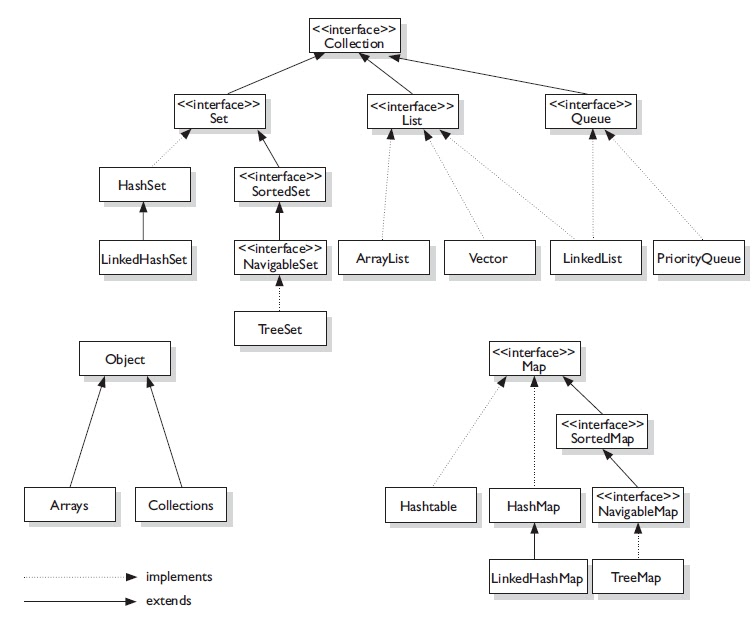

# collections framework
* data structures
* Important interfaces: `List`, `Set`, `Map`
* Other important interfaces: `Iterable`, `Collection`
* many other interfaces, abstract classes, and classes



# [List](https://docs.oracle.com/javase/8/docs/api/java/util/List.html)
* elements
* retain insertion order
* useful methods
  * `add`
  * `remove`
  * `get`
  * `size`
  * `iterator`
  * `listIterator`

# [Set](https://docs.oracle.com/javase/8/docs/api/java/util/Set.html)
* unique elements
  * `equals` method
* does not retain insertion order
* useful methods
  * `add`
  * `remove`
  * `contains`
  * `size`
  * `iterator`

# [Map](https://docs.oracle.com/javase/8/docs/api/java/util/Map.html)
* key value pairs
* useful methods
  * `put`
  * `remove`
  * `get`
  * `keySet`
  * `values`
  * `entrySet`

# Iterator
* interface
  * `hasNext`, `next`, `remove`
* creator of collection is responsible for implementing `Iterator`
  * `next` is guaranteed **O(1)**
* can use if collection **is a** `Iterable`

common looping idiom

```
List<Integer> list = new ArrayList<>();
list.add(10);
list.add(20);
list.add(30);

Iterator<Integer> iterator = list.iterator();

while(iterator.hasNext()) {
  Integer temp = iterator.next();
}
```

# foreach
* also called **enhanced for loop**
* converted to use `Iterator` behind the scenes
* cannot modify collection - `ConcurrentModificationException`

common looping idiom

```
List<Integer> list = new ArrayList<>();
list.add(10);
list.add(20);
list.add(30);

for(Integer temp : list) {

}
```

IQ: difference between `for`, `foreach`, `Iterator`

# Other collections
* `LinkedList`, `Stack`, `Queue`, `Deque`
* `Vector` vs `ArrayList`
* `HashSet` vs `TreeSet`
* `HashMap` vs `TreeMap`
